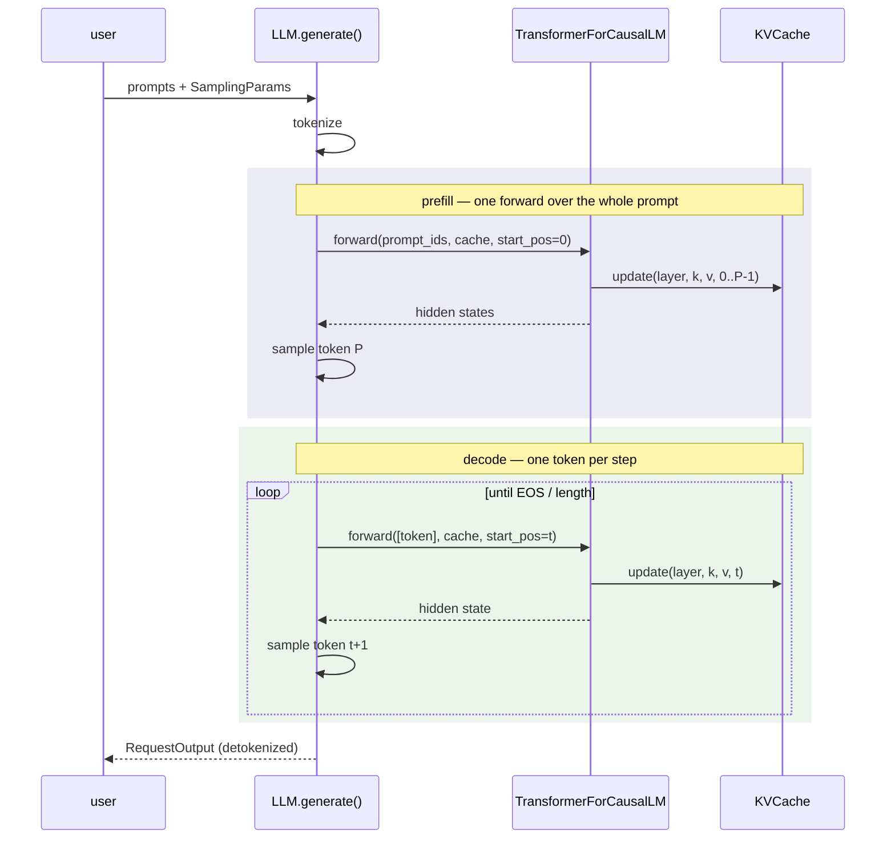

# 001 — Engine Core (M1): a correct single-sequence engine

**Status:** implemented
**Scope:** from-scratch decoder, checkpoint loading, contiguous KV cache, sampling,
single-sequence generation loop.

## Goals

1. A decoder-only transformer implemented from scratch in PyTorch that produces
   logits numerically matching the Hugging Face reference for the Llama / Qwen2 /
   Qwen3 families.
2. The simplest KV cache that is *correct*, as the baseline paged attention (M2)
   will be measured against.
3. A generation loop with the stop conditions and reproducible sampling that every
   later milestone reuses unchanged.

**Non-goals (deliberately deferred):** batching of any kind (M3), memory-efficient
cache layout (M2), custom kernels (M4), chunked prefill, tensor parallelism.

## Architecture



Module layout mirrors the responsibility split that later milestones need:

| Module | Responsibility | Changes in later milestones |
|---|---|---|
| `config.py` | frozen `ModelConfig` parsed from HF `config.json` | stable |
| `model/layers.py` | RMSNorm, RoPE, SwiGLU | stable |
| `model/transformer.py` | attention + decoder stack | attention backend abstraction (M2/M4) |
| `model/kv_cache.py` | contiguous per-sequence cache | replaced by block manager + paged cache (M2) |
| `model/loader.py` | safetensors → parameters | stable |
| `sampling/sampler.py` | temperature / top-k / top-p | extended for speculative verification (M5) |
| `engine/llm.py` | sequential generation loop | replaced by scheduler-driven step loop (M3) |
| `engine/sequence.py` | request state machine | gains block-table bookkeeping (M2/M3) |

## Key decisions

### One architecture implementation, config-driven

Llama, Qwen2, and Qwen3 share a skeleton (pre-norm decoder, RoPE, GQA, SwiGLU) and
differ in three switches captured in `ModelConfig`:

- `attention_bias` — Qwen2 puts biases on Q/K/V projections (hardcoded in HF's
  modeling code, not exposed in its config).
- `use_qk_norm` — Qwen3 applies per-head RMSNorm to Q and K *before* RoPE, replacing
  Qwen2's biases.
- `head_dim` — Qwen3 decouples it from `hidden_size / num_heads` (0.6B: 128 vs. 64).

One implementation with explicit switches beats three near-identical model files at
this scale; vLLM makes the opposite trade because it supports hundreds of
architectures.

### Checkpoint names are the module tree

Module attribute names (`model.layers.N.self_attn.q_proj`…) deliberately mirror the
HF checkpoint layout, so weight loading is `named_parameters()` lookup plus shape
validation — no renaming table to maintain, and unexpected/missing/misshapen weights
fail loudly. The one subtlety is tied embeddings: `named_parameters()` deduplicates
shared tensors, so a checkpoint-level `lm_head.weight` is skipped when
`tie_word_embeddings` is set (the copy into `embed_tokens.weight` covers it).

### Numerical conventions follow the reference implementation

Parity at bf16 requires performing the same operations in the same dtypes: RMSNorm
statistics in float32 with the weight multiply in the activation dtype; RoPE tables
computed in float32 and applied in the activation dtype; logits projected then read
in float32. These match HF `transformers`, which is what makes the parity tests
meaningful at tight tolerances.

### Contiguous KV cache, sized per request

Layout: `[num_layers, batch, num_kv_heads, max_seq_len, head_dim]`, preallocated at
request start for `prompt_len + max_new_tokens` (capped by `max_seq_len`). Memory per
token is

```
2 · num_layers · num_kv_heads · head_dim · dtype_bytes
    = 2 · 28 · 8 · 128 · 2 B  =  112 KiB/token   (Qwen3-0.6B, bf16)
```

so a full 40,960-token context reserves ~4.4 GiB *per sequence* — the number that
motivates paged allocation in M2. Prefill writes positions `[0, P)`; each decode step
writes position `t` and attends over `[0, t]` via views into the buffer (no copies).

### SDPA with `is_causal` only where it is correct

`F.scaled_dot_product_attention(is_causal=True)` aligns the causal mask to the
top-left corner, which is correct only when the query and key lengths match. The M1
engine has exactly two shapes: full prefill (square, `is_causal=True`) and
single-token decode (the new token attends to everything, no mask). Anything else —
i.e. chunked prefill — raises `NotImplementedError` rather than silently computing
the wrong mask.

## Correctness strategy

Three layers of defense, each catching what the previous cannot:

1. **Property tests on layers** (CPU, no weights): RoPE preserves norms and depends
   only on relative position; RMSNorm matches its formula; SwiGLU gating zeroes.
2. **Incremental-vs-full equivalence** (CPU, random tiny models, all three
   architecture variants): decoding token-by-token through the KV cache must
   reproduce the logits of one full forward pass. This exercises cache indexing,
   causal masking, GQA, and position handling with no reference implementation in
   the loop.
3. **Parity against `transformers`** (fp32 CPU, real Qwen3-0.6B weights): prefill
   logits within `1e-3` max-abs-diff with exact argmax agreement at every position,
   and 32-token greedy generation token-identical to `model.generate()`.

Sampling is validated separately with distribution-support tests (top-k/top-p
nucleus membership over seeded draws).

## Known limitations

- One request at a time; GPU utilization during decode is poor by design (this is
  the baseline the roadmap exists to improve).
- KV memory is reserved for the worst case at request start (fixed by M2).
- No chunked prefill; prompts are bounded by `max_seq_len`.
- `torch.multinomial` sampling on CUDA is reproducible per-device given a seed,
  but not guaranteed identical across GPU models or PyTorch versions.

## References

- Vaswani et al., *Attention Is All You Need*, NeurIPS 2017.
- Su et al., *RoFormer: Enhanced Transformer with Rotary Position Embedding*, 2021. arXiv:2104.09864.
- Zhang & Sennrich, *Root Mean Square Layer Normalization*, NeurIPS 2019.
- Shazeer, *GLU Variants Improve Transformer*, 2020. arXiv:2002.05202.
- Ainslie et al., *GQA: Training Generalized Multi-Query Transformer Models*, EMNLP 2023.
- Holtzman et al., *The Curious Case of Neural Text Degeneration*, ICLR 2020.
- Qwen Team, *Qwen3 Technical Report*, 2025. arXiv:2505.09388.
- Kwon et al., *Efficient Memory Management for Large Language Model Serving with PagedAttention*, SOSP 2023.
